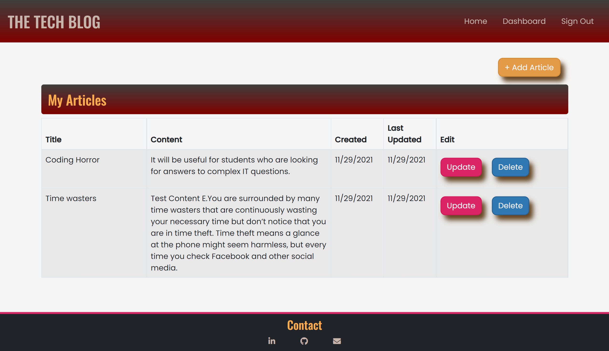

# 14 Model-View-Controller (MVC): Tech Blog

## Description 

Build a CMS-style blog site similar to a Wordpress site, where developers can publish their blog posts and comment on other developers’ posts as well. The site is built from scratch and deployed to Heroku. It follows the MVC paradigm in its architectural structure, using Handlebars.js as the templating language, Sequelize as the ORM, and the express-session npm package for authentication.

## Table of Contents
- [Description](#description)
- [Acceptance Criteria](#acceptanceCriteria)
- [Technologies](#technologies)
- [Installation & Usage](#installation&usage)
- [Links](#links)
- [Screenshots](#screenshots)

## Acceptance Criteria

1. When a user visits the site for the first time, they are presented with the homepage, which includes existing blog posts if any have been posted; navigation links for the homepage and the dashboard; and the option to log in.
2. When a user clicks on the homepage option, they are taken to the homepage.
3. When a user clicks on any other links in the navigation, they are prompted to either sign up or sign in.
4. When a user chooses to sign up, they are prompted to create a username and password.
5. When a user clicks on the sign-up button, their user credentials are saved and they are logged into the site.
6. When a user revisits the site at a later time and choose to sign in, they are prompted to enter their username and password.
7. When a user is signed in to the site, they see navigation links for the homepage, the dashboard, and the option to log out.
8. When a user clicks on the homepage option in the navigation, then they are taken to the homepage and presented with existing blog posts that include the post title and the date created.
9. When a user clicks on an existing blog post, they are presented with the post title, contents, post creator’s username, and date created for that post and have the option to leave a comment.
10. When a user enters a comment and clicks on the submit button while signed in, the comment is saved and the post is updated to display the comment, the comment creator’s username, and the date created.
11. When a user clicks on the dashboard option in the navigation, they are taken to the dashboard and presented with any blog posts they have already created and the option to add a new blog post.
12. When a user clicks on the button to add a new blog post, they are prompted to enter both a title and contents for my blog post.
13. When a user clicks on the button to create a new blog post, the title and contents of their post are saved and they are taken back to an updated dashboard with the new blog post.
14. When a user clicks on one of their existing posts in the dashboard, they able to delete or update their post and are taken back to an updated dashboard.
15. When a user clicks on the logout option in the navigation, they are signed out of the site.
16. When a user is idle on the site for more than a set time, they are able to view comments but are prompted to log in again before they can add, update, or delete comments.

## Technologies

- JavaScript
- MySQL
- Node.js
- [NPM Express.js Package](https://www.npmjs.com/package/express)
- [NPM Handlebars.js Package](https://www.npmjs.com/package/handlebars)
- [NPM Sequelize ORM Package](https://www.npmjs.com/package/sequelize)
- [NPM Express-Session Package](https://www.npmjs.com/package/express-session)
- [NPM Cookies Package](https://www.npmjs.com/package/cookies)
- [NPM bcrypt Package](https://www.npmjs.com/package/bcrypt)
- [NPM Router Package](https://www.npmjs.com/package/router)
- [NPM dotenv Package](https://www.npmjs.com/package/dotenv)
- [NPM mysql2 Package](https://www.npmjs.com/package/mysql2)
- [NPM connect-session-sequelize Package](https://www.npmjs.com/package/connect-session-sequelize?activeTab=versions)

## Installation & Usage

To use this app, you will need a MySQL Workbench account, and to have the app installed on your machine. Documentation with installation instructions are available [here.](https://dev.mysql.com/doc/workbench/en/wb-installing.html) 

STEP 1

    1.1 Clone this Tech-Blog repo to your machine.

STEP 2

From Visual Studio Code or the code editor of your choice:

    2.1 Open the repo.  
    2.2 Locate and open the .env.EXAMPLE file, located in the root directory.
    2.3 Add your own MySQL Workbench Username and Password to the env.EXAMPLE file.
    2.4 Re-name the file to .env (i.e. remove .EXAMPLE).
    2.5 Save your changes.
    2.6 Locate and open db\schema.sql.
    2.7 Copy and paste the database schema into a new MySQL Workbench query tab and run it. Refresh and view your updated schemas to ensure that techblog_db now appears.

STEP 3

From your terminal, run:

    3.1 npm i
    3.2 npm run seed

STEP 4

From the modern browser of your choice, visit:

    4.1 http://localhost:3001

## Links

* [The URL of the GitHub repository](https://github.com/Ruchi479/Tech-Blog.git)

* [The URL of application deployed on heroku]()

## Screenshots 

